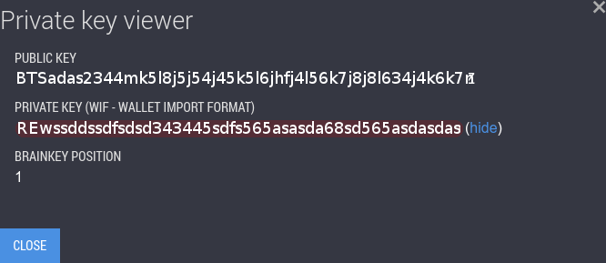

# Openledger nodejs api

[](https://bitshares.openledger.info)

### Set accounts and wif passwords
It's required.

you need get your WIF private key from https://bitshares.openledger.info

these keys required for create transaction and read memo

[](https://bitshares.openledger.info)

go to cfg.js file and edit.

for example:
```sh
module.exports = {
    wssapi: 'wss://bitshares.openledger.info/ws',  // you can choose blockchain server for send your request
    localhost: '127.0.0.1', //your web server
    private_keys: {
        "user-1": '5RTTdfdfdf456456fghfg546kliopiogfghfghxxxxxsdasdasd',
        "name_of_user_2": 'SET YOUR WIF PRIVATE KEY HERE...',
        "name_of_user_3": 'SET YOUR WIF PRIVATE KEY HERE...'
    }
};
```

### Installation
This script for fast install (install nodejs, dependencies and run server on port :8080).
```sh
$ git clone github
$ cd openledger_nodejs_api
$ chmod +x startshell.sh && ./startshell.sh
```
### Custom install
If you dont have nodejs you need install requires [Node.js](https://nodejs.org/) v6+ to run.
We recommended install Nodejs 7. [node.js package-manager](https://nodejs.org/en/download/package-manager/)

### Run server on custom port

```sh
node server_api.js PORT
```
for example:
```sh
node server_api.js 8090
```
default value of port is 8090

### Routing

this api have two urls paths:
- http://127.0.0.1/api/transfer (POST)
- http://127.0.0.1/api/api/history (POST)

Please format body as JSON.

http://127.0.0.1/api/transfer for transaction actions.

http://127.0.0.1/api/history get history of blockchain.
### Examples

DON'T FORGET TO ADD KEYS IN CFG.JS AS METIONED ABOVE (cfg.js)

[Examles in browser](Examles_in_browser.md) 
 
[Examles uses CURL](Examles_uses_CURL.md) 